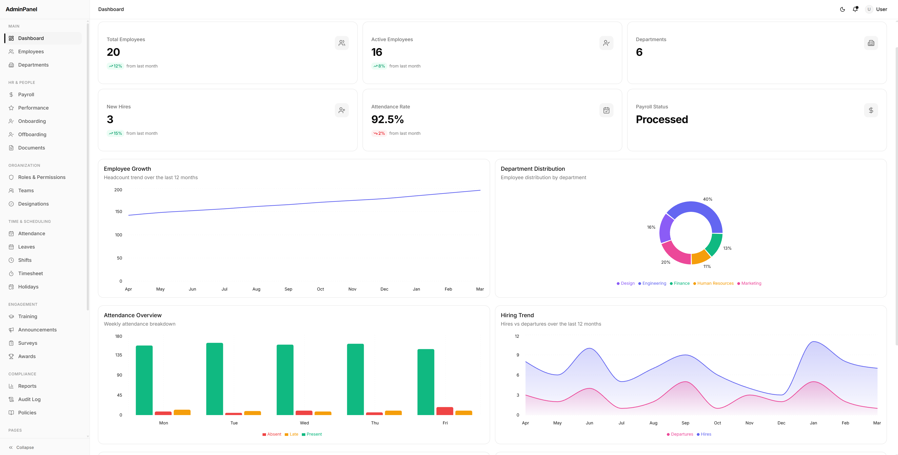

# Alpine Admin

A React admin panel built with [Vite](https://vite.dev) and [react-router-dom](https://reactrouter.com). Originally converted from a Next.js (App Router) project.



## Live Demo

- **Docs / landing:** [codespanda.github.io/Alpine-Admin-React](https://codespanda.github.io/Alpine-Admin-React/)
- **Dashboard:** [codespanda.github.io/Alpine-Admin-React/dashboard](https://codespanda.github.io/Alpine-Admin-React/dashboard)

## Tech Stack

- **React 19** + **Vite 6** (TypeScript)
- **react-router-dom** for routing
- **Tailwind CSS v4** + **shadcn/ui** components
- **Zustand** for state, **React Hook Form** + **Zod** for forms
- **TanStack Table** for data tables, **Recharts** for charts
- **next-themes** for theming

## Getting Started

Install dependencies and run the development server:

```bash
npm install
npm run dev
```

Open [http://localhost:5173](http://localhost:5173) with your browser to see the result.

## Scripts

| Command           | Description                          |
| ----------------- | ------------------------------------ |
| `npm run dev`     | Start the Vite dev server            |
| `npm run build`   | Type-check and build for production  |
| `npm run preview` | Preview the production build locally |
| `npm run lint`    | Run ESLint                           |

## Project Structure

- `index.html` → `src/main.tsx` → `src/App.tsx` (route table)
- Page components live under `src/app/(admin)` and `src/app/(auth)`, wired up explicitly in `src/App.tsx`
- `src/lib/router.tsx` is a compatibility shim mapping the old Next navigation API (`Link`, `usePathname`, `useRouter`, `useParams`, `useSearchParams`) onto react-router — import navigation helpers from `@/lib/router`
- `src/components` — shared UI and shadcn components; `src/features` — feature modules
